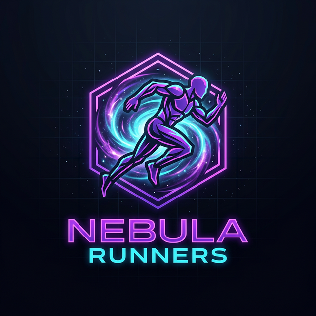
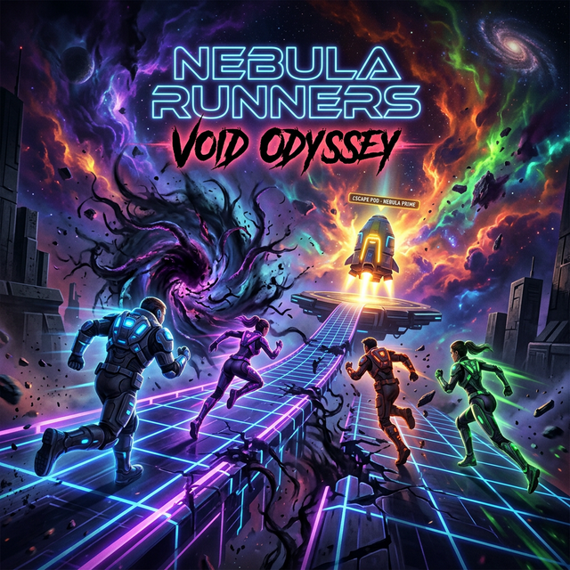
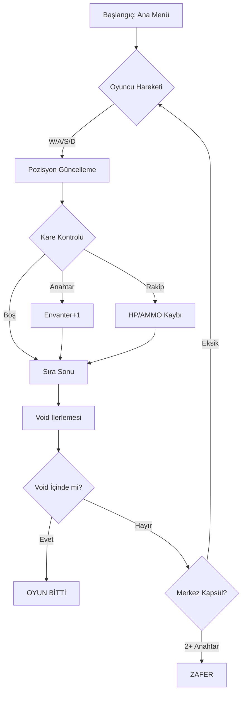
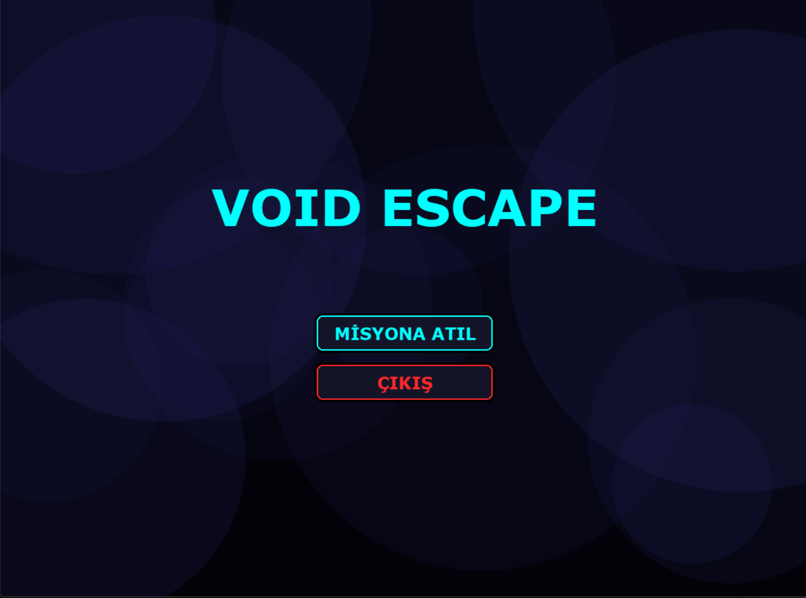
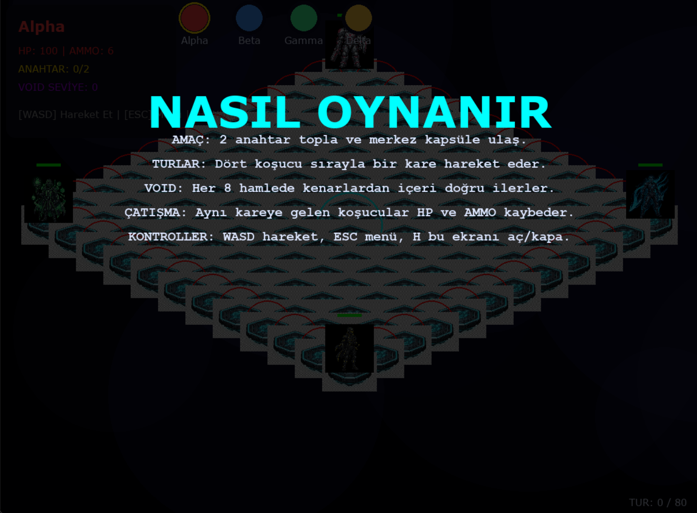

<p align="center">
  
</p>

# <p align="center">🌌 NEBULA RUNNERS: VOID ODYSSEY</p>

<p align="center">
  <i>"Galaksinin kıyısında, Void her şeyi yutarken tek bir çıkış yolu kaldı. Koş ya da yok ol."</i>
</p>

<p align="center">
  
</p>

<p align="center">
  
  
  
  
</p>

---

## 🚀 Genel Bakış

**Nebula Runners: Void Odyssey**, taktiksel derinliği ve atmosferik tasarımıyla öne çıkan izometrik bir hayatta kalma oyunudur. Sürekli daralan **Void** mekaniği ile her hamlenin hayati önem taşıdığı, zamanla yarıştığınız bir strateji deneyimi sunar.

### ✨ Temel Özellikler

| Özellik | Açıklama |
| :--- | :--- |
| 🌀 **Dinamik Void** | Haritayı kenarlardan merkeze doğru yok eden gerçek zamanlı karanlık. |
| 🕹️ **İzometrik Strateji** | Derinlik algısı yüksek, modern grid tabanlı hareket sistemi. |
| ⚔️ **Taktiksel Çatışma** | Kaynak yönetimi (HP/AMMO) ve rakip etkileşimleri. |
| 💎 **Görev Odaklı** | 3 anahtarı topla ve merkezdeki tek tahliye kapsülüne ulaş! |

---

## 🎬 Hikaye: Son Sinyal

> *"Yıl 3042. Galaksinin merkezindeki Void kontrolden çıktı. Boyut her saniye daralıyor, önüne çıkan her şeyi yutuyor. Kurtuluş için tek bir çıkış kapsülü kaldı. Ama bir sorun var: Kapsül kilitli ve şifre anahtarları karanlığın tam kalbinde..."*

Dört elit koşucu (**Alpha**, **Beta**, **Gamma**, **Delta**), sistemin merkezindeki tek tahliye kapsülüne ulaşmak için zamana ve birbirlerine karşı yarışıyor.

---

## 🎮 Kontroller

> [!TIP]
> Hareket ederken Void'in hızını takip etmeyi unutmayın! Sadece 80 turunuz var.

- ⌨️ **W, A, S, D**: Aktif Koşucuyu Hareket Ettir
- ⌨️ **H**: Yardım / Nasıl Oynanır Paneli
- ⌨️ **ESC**: Ana Menü / Çıkış
- ⌨️ **SPACE**: Hikaye Anlatımını Geç
- ⌨️ **ENTER**: Oyun Sonu: Yeniden Başlat

---

## ⚙️ Oyun Akışı

Aşağıdaki diyagram, **Nebula Runners**'ın temel oyun döngüsünü ve Void mekaniğinin işleyişini göstermektedir:



---

## 🛠️ Kurulum

```bash
# 1. Projeyi bilgisayarınıza indirin
git clone https://github.com/kullaniciadi/void-escape.git
cd void-escape

# 2. Gerekli kütüphaneleri kurun
pip install pygame

# 3. Macerayı başlatın
python main.py
```

---

## 🗺️ Proje Yapısı

```text
📂 python_proje
├── 📂 assets           # Görsel varlıklar ve Branding
│   ├── 📂 branding     # Logo ve Banner tasarımları
│   └── 📂 screenshots  # Oyun içi görüntüler
├── 📂 src
│   ├── 📂 core         # Render motoru ve State yönetimi
│   ├── 📂 entities     # Oyuncu ve Harita sınıfları
│   ├── 📂 ui           # HUD ve Arayüz elemanları
│   └── 📂 utils        # Sabitler ve Yardımcı araçlar
└── main.py             # Başlangıç dosyası
```

---

## 🖼️ Ekran Görüntüleri

| Ana Menü | Nasıl Oynanır |
| :---: | :---: |
|  |  |

---

## 👤 İletişim

**[Adınız Soyadınız]**
- [LinkedIn](https://linkedin.com/in/kullaniciadi)
- [Portfolyo](https://portfolyo-siteniz.com)

---
<p align="center">
  <i>Bu proje bir tutku projesi olarak sıfırdan geliştirilmiştir. Tüm hakları saklıdır.</i>
</p>

